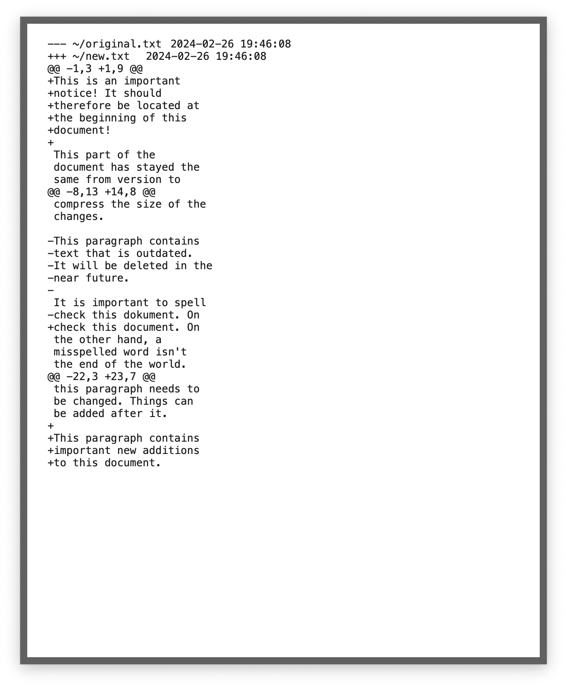
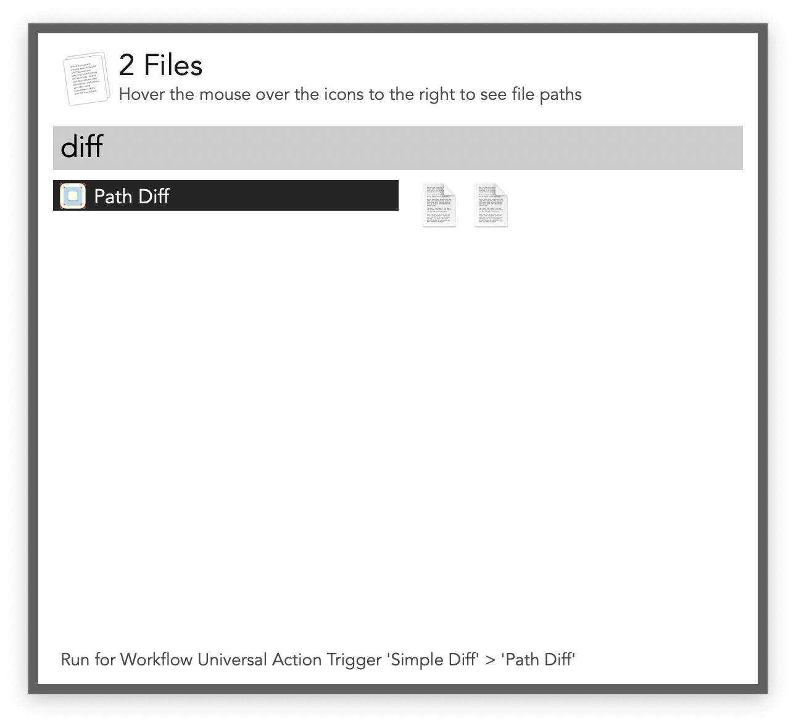

#  Simple Diff Alfred Workflow

View differences in text, files, and directories

[⤓ Install on the Alfred Gallery](https://alfred.app/workflows/alfredapp/simple-diff)

## Usage

Compare the two most recent clipboard entries via the `clipdiff` keyword. Press <kbd>↩&#xFE0E;</kbd> on the result to copy it to the clipboard.

Compare two files or folders via the [Universal Action](https://www.alfredapp.com/help/features/universal-actions/).

